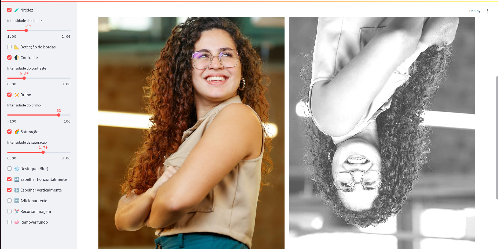
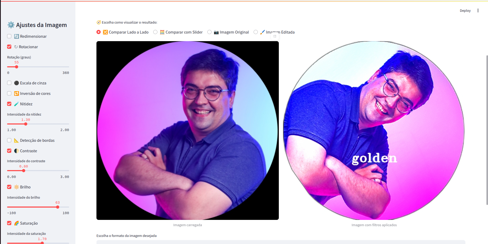

# 🖼️ Visualizador e editor de imagens

Esse é um app feito com [Streamlit](https://streamlit.io/) pra editar imagens de forma super fácil e visual. Dá pra aplicar filtros, ajustar cor, brilho, nitidez, cortar, girar, escrever por cima e até remover o fundo da imagem. Tudo isso direto do navegador, com uma interface bem amigável.

## 🎯 O que dá pra fazer?

- Usar a sidebar pra aplicar vários efeitos e ajustes de imagem.
- Salvar suas configurações e usar de novo em outras imagens (ótimo pra editar em lote).
- Comparar a imagem original com a editada de várias formas.
- Baixar a imagem final em **PNG**, **JPEG** ou **PDF**.
- E o melhor: dá pra tirar o fundo da imagem com um clique!

## 🛠️ Filtros e ajustes disponíveis

### 🔄 Redimensionar
Altere a largura e altura da imagem.

### ↻ Rotacionar
Gire a imagem no sentido horário com um slider de 0 a 360 graus.

### ⚫ Escala de Cinza
Remove as cores e deixa a imagem em preto e branco.

### 🔁 Inverter Cores
Cria um efeito de negativo, invertendo todas as cores.

### 🧪 Nitidez
Aumenta os detalhes da imagem. Você escolhe a intensidade com um slider.

### 📐 Detecção de Bordas
Destaca os contornos da imagem com o filtro Canny.

### 🌓 Contraste
Ajusta o contraste – quanto mais alto, maior a diferença entre claro e escuro.

### 🔆 Brilho
Clareia ou escurece a imagem.

### 🌈 Saturação
Deixa as cores mais vivas ou mais lavadas.

### 💨 Desfoque
Aplica aquele efeito de imagem desfocada (blur).

### ↔️ Espelhar Horizontalmente
Inverte a imagem da esquerda pra direita.

### ↕️ Espelhar Verticalmente
Inverte a imagem de cabeça pra baixo.

### 🔤 Adicionar Texto
Escreva o que quiser sobre a imagem com:
- Texto personalizado
- Cor, tamanho e posição
- Escolha de fonte (várias do OpenCV)

### ✂️ Recortar Imagem
Dá pra cortar por pontos (`X1, Y1, X2, Y2`) ou por tamanho (`largura x altura` a partir de um ponto inicial).

### 🧼 Remover Fundo
Remove o fundo da imagem e deixa só o objeto principal. Bem útil!

## 👁️ Como ver o resultado

Você pode visualizar de várias formas:

- 🔀 Lado a lado: original x editada
- 🧮 Slider interativo: arrasta pra comparar
- 📷 Só a original
- 🖌️ Só a editada


## 💾 Baixar a imagem

Depois de editar, você escolhe o formato e baixa:
- PNG
- JPEG
- PDF


## 📚 Por que vários `if` separados na sidebar?

Optei por usar `if` separados pra cada controle, separado de sua aplicação por três motivos:

1. **Independência**: Cada filtro funciona sozinho e não interfere nos outros.
2. **Praticidade**: Você ajusta uma vez e pode usar os mesmos parâmetros em várias imagens sem mexer de novo.
3. **Manutenção fácil**: Fica mais simples adicionar novos filtros e corrigir bugs.

Sim, o código ficou com mais `if`, mas ficou mais organizado e flexível pra qualquer situação!


## 🧪 Exemplos






## 🚀 Tecnologias usadas

- **Streamlit**
- **OpenCV**
- **Pillow**
- **rembg**
- **streamlit-image-comparison**

## ⚙️ Como rodar

1. Clone o projeto:
```bash
git clone https://github.com/yasmimpassos/visualizador-imagens.git
```

2. Instale as dependências:
```bash
pip install -r requirements.txt
```

3. Rode o app:
```bash
streamlit run visualizador.py
```